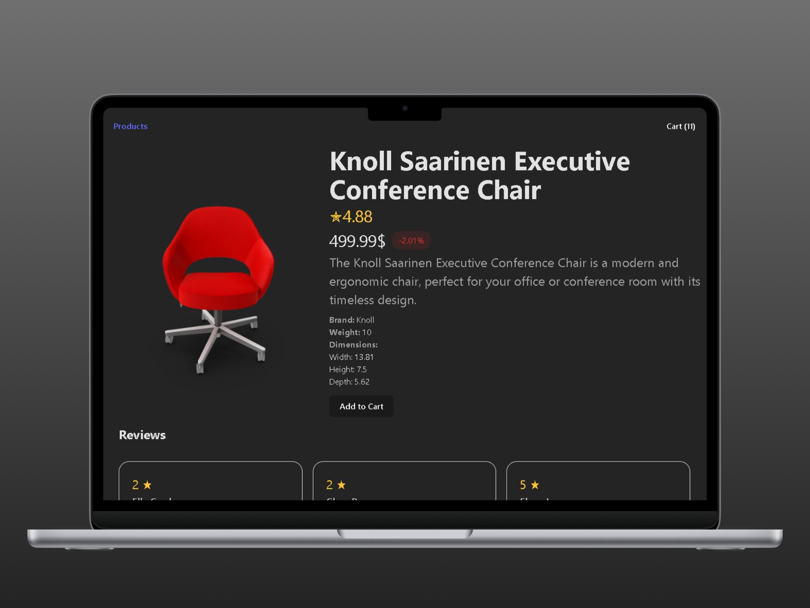

## Overview

A modern **E-commerce Products App frontend** built with **React, Tailwind CSS, and React Query**.  
This project showcases **product listing, search, category filter, sorting, pagination, and shopping cart functionality**.

This project also marks my **return to programming after 14 months of military service**.

---

## Features

- **Product Listing**: Fetch products from [DummyJSON API](https://dummyjson.com/products), with pagination.

- **Search & Filter**: Debounced search input and category filter.
- **Sorting**: Sort products by price or rating.
- **Add to Cart**: Add products, adjust quantity, remove items, and persist cart in LocalStorage.
- **UX Enhancements**: Loading indicators, memoized sorting/filtering, responsive layout, toast notifications.

---

## Technologies 

- React

- React Query

- React Hot Toast (notifications)

- LocalStorage (cart persistence)

- Search + Debounce

- Categories

- Sorting

- Pagination

- Add to Cart (Context + Reducer)

- LocalStorage

- Performance optimization (useMemo)

---

## Challenges & Solutions

- Search losing focus: Solved with debounced input and isFetching loading indicator.

- Pagination edge cases: Disabled "Next" on last page.

- Dynamic Add to Cart: Implemented CartContext with useReducer and LocalStorage.

- Missing product images: Fallback to thumbnail when main image is missing.

 
<!--  It took around 3–4 weeks including learning, refactoring, and improving the user experience.

 The development itself was faster, but I spent time experimenting, fixing real issues, and improving performance. -->
 